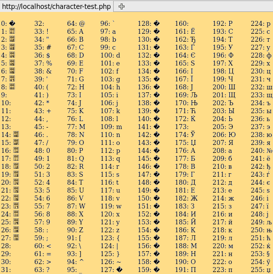

# Password Generator

 

## Objective
Using a prewritten HTML and CSS template, use Javascript to create a functional password generator that prompts user to input desired password length and character styles. (Uppercase, Lowercase, Numbers, and Special Characters)

 

## Technologies Used

* Javascript
* HTML
* Unicode
* Visual Studio Code

 

## How it works

 

### Prompts

When user clicks the 'Generate' button, a series of prompts and confirm alerts ask the user about their specific preferences in the password that is generated.

 
 

If a prompt is confirmed, their **var** value becomes true and triggers **if statements** within the 'main' function.

 
 

 

These **if statements** push items into the empty array of 'characterTypes.'

 

### ChrChoice Randomizer

Inside a **for loop** that runs however many times the user inputs to be their password length, the variable of 'chrChoice' randomly chooses between the items in the array.
 

 

### Unicode Randomizer

Depending on which item in the array is chosen, an **if statement** is triggered that randomly generates a number between a given set of values, then converts them to letters based on its Unicode equivalent. Then the chosen letter is added to the **placeholder** HTML property in the 'textarea' element.

 

.
 
 
 
 
 

## Author
 
Aaron Diggdon

 
 

## Licence
 

