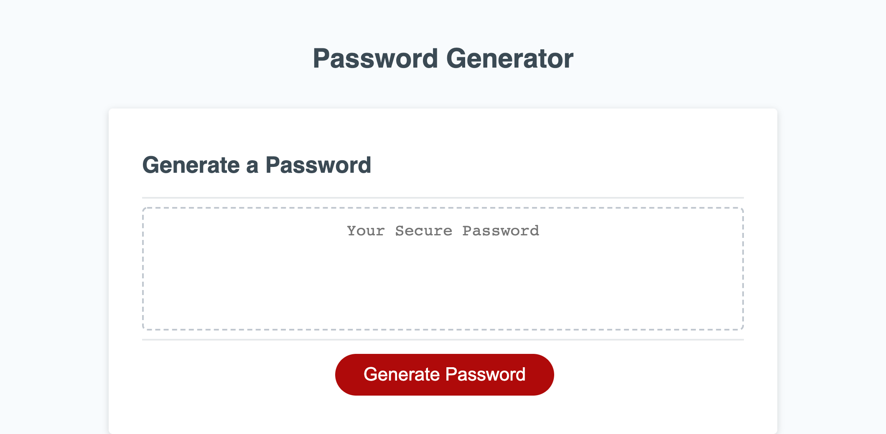

# Password Generator

 

## Objective
Using a prewritten HTML and CSS template, use Javascript to create a functional password generator that prompts user to input desired password length and character styles. (Uppercase, Lowercase, Numbers, and Special Characters)
